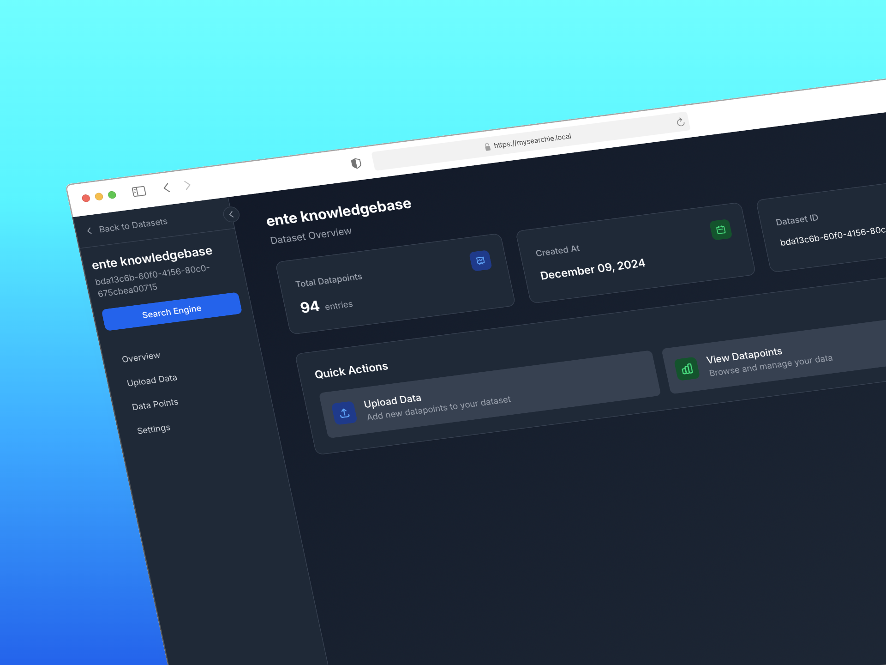
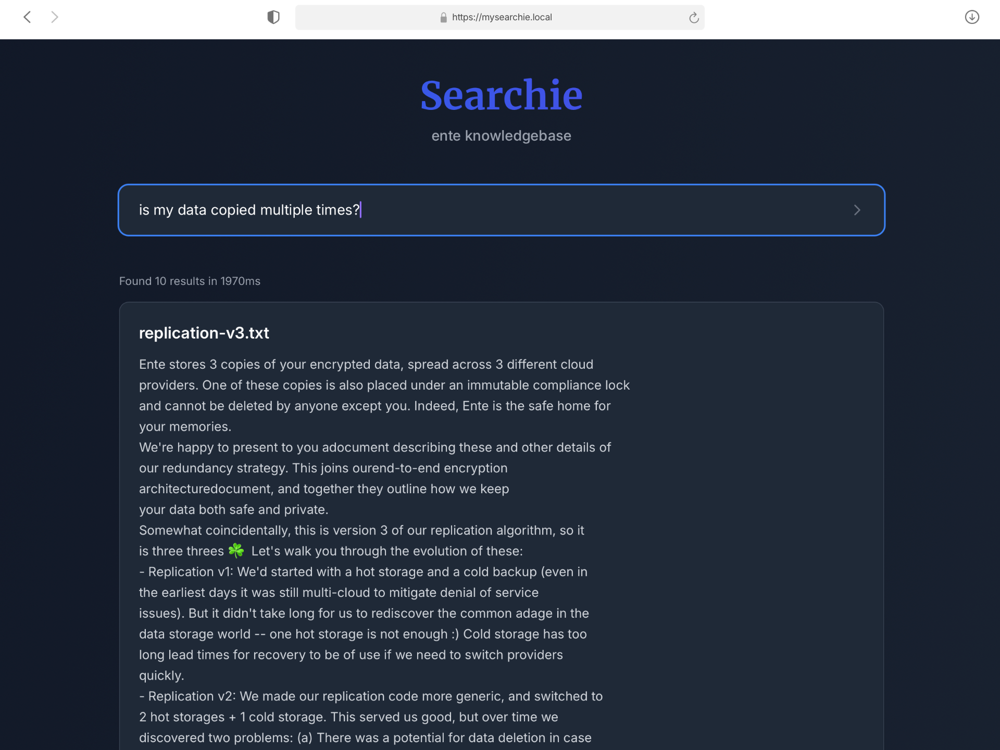

# searchie

Searchie is an all-in-one platform for building and managing your own search engine on your own data. Just drag and drop your files and Searchie will take care of the rest by extracting the semantic meaning of your data and letting you query it with natural language, just like Google.

